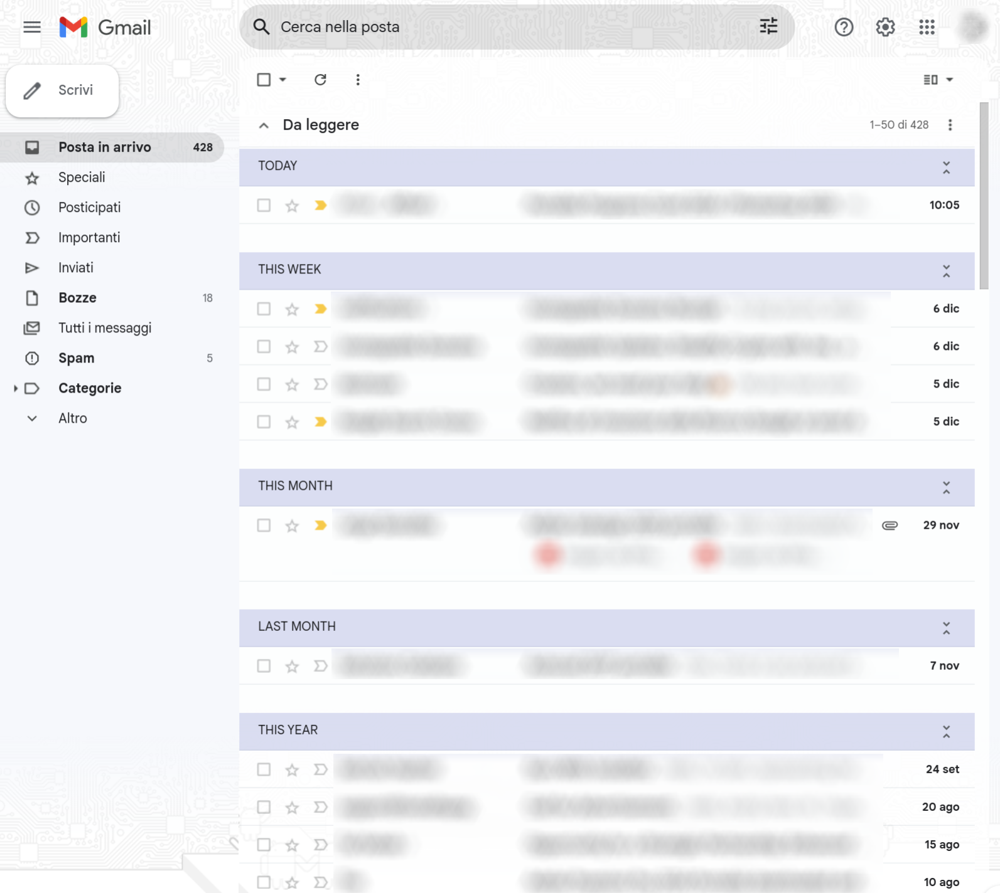

# Inboxifier - Gmail date grouping, Inbox style

Inboxifier (or InboxiFIRE?? 🔥) is a Chromə extension enhances the Gmail web interface by grouping emails based on their dates. Yes, I miss [Inbox by Gmail](https://en.wikipedia.org/wiki/Inbox_by_Gmail) too!

## Features

- Groups emails by date for better visual organization:
  - Today
  - Yesterday
  - This Week (last 7 days)
  - This Month (last 30 days)
  - Last Month (last 60 days)
  - This Year (last 365 days)
  - Previous
- Collapse individual groups
- Supports multiple languages for textual date detection (English and Italian as of now).
- Handles various date formats

## Usage

You load the folder as an 'unpacked extension' in Chromə. In particular:

1.  Clone or download the repository to your local machine

2. Open Chromə Txtensions page, something like `chrome://extensions/`

3. In the top right corner, toggle the switch to enable "Developer mode".

4. Click on the "Load unpacked" button and select the directory where you downloaded the extension files.

5. The extension should now appear in your list of installed extensions. Make sure it is enabled.

6. Open Gmail and enjoy the new date grouping feature!

## TODO

This is an early stage version with basic functionalities.

- Refresh groups on email modification
- Bulk group actions (select, read, archive)
- Customization:
  - Customizable date grouping
  - Customizable CSS
- More features from Inbox?

## Credits

This project is based on the original [Gmail Date Grouping](https://chromewebstore.google.com/detail/gmail-date-grouping/ebjaeihadbjolpliahkicnmoegojpcjj) extension by jansmi. It was made with react and surely heavier than it needs to be, but for now it'll do.

The main differences include:

- Dynamic date grouping relative to current day, with improved parsing logic for various formats.
- Relative timeframe grouping instead of day-by-day.
